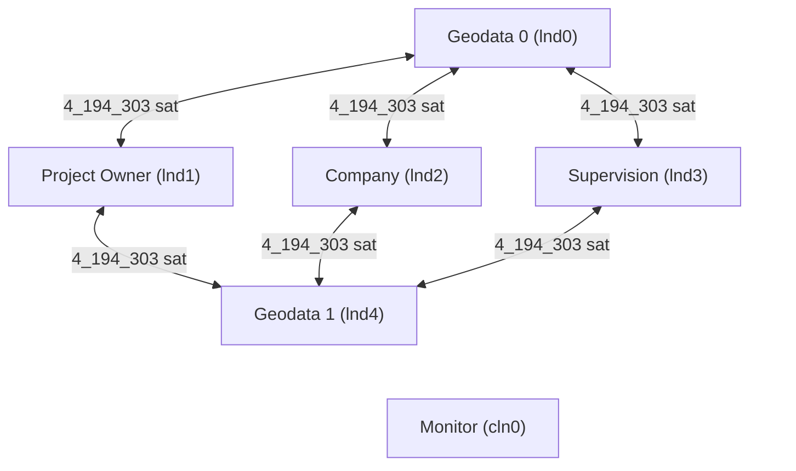

lightning-regtest-setup-devel
===

## Development

### Requirements
- docker compose (v2.32.1)
- jq (>=1.7.1)
- just (>=1.38.0)

### Clone
```
git clone https://github.com/theborakompanioni/lightning-regtest-setup-devel
```

### Typical workflow
```bash
just up
just init
just probe-payment # loops indefinitely
just probe-keysend # loops indefinitely
just just probe-keysend-lnd0-lnd4 21 # send 21 sats from lnd0 to lnd4
just listchannels # print channel info
[...]
just clean
```

#### UI

"Ride The Lightning" is reachable on http://localhost:13000 with password "rtl".


### Channels


### Tasks

#### `getinfo`
```shell
just getinfo
```
```shell
## bitcoin
# bitcoin
bitcoin container name: regtest_bitcoind
bitcoin container rpcport: 18443
Chain: regtest
Blocks: 132
Headers: 132
Verification progress: 100.0000%
Difficulty: 4.656542373906925e-10

Network: in 0, out 0, total 0
Version: 270000
Time offset (s): 0
Proxies: n/a
Min tx relay fee rate (BTC/kvB): 0.00001000

Warnings: (none)
## lnd0
0210d2d7afe5a33f66d77e391417015e008bed2a2be4243a1f3c09b7d10be20ae8
lnd0 container name: regtest_lnd_tier0_geodata
lnd0 rest endpoint: https://localhost:10841
lnd0 getinfo:
{
  "version": "0.18.5-beta commit=v0.18.5-beta",
  "identity_pubkey": "0210d2d7afe5a33f66d77e391417015e008bed2a2be4243a1f3c09b7d10be20ae8",
  "alias": "lnd_tier0_geodata",
  "num_peers": 3,
  "num_pending_channels": 0,
  "num_active_channels": 3,
  "num_inactive_channels": 0,
  "block_height": 132,
  "chains": [
    {
      "chain": "bitcoin",
      "network": "regtest"
    }
  ]
}
## lnd4
03eaf815593ee59b84e94bb0f9f52e93f7fb48ab088aab2b6b8df8d7ffd92ef0a2
lnd4 container name: regtest_lnd_tier2_geodata
lnd4 rest endpoint: https://localhost:14841
lnd4 getinfo:
{
  "version": "0.18.5-beta commit=v0.18.5-beta",
  "identity_pubkey": "03eaf815593ee59b84e94bb0f9f52e93f7fb48ab088aab2b6b8df8d7ffd92ef0a2",
  "alias": "lnd_tier2_geodata",
  "num_peers": 3,
  "num_pending_channels": 0,
  "num_active_channels": 3,
  "num_inactive_channels": 0,
  "block_height": 132,
  "chains": [
    {
      "chain": "bitcoin",
      "network": "regtest"
    }
  ]
}
```

#### `listbalances`
```shell
just listbalances
```
```shell
## lnd0
0251cea2f33486dd2f8dcd8c2b27b6d6e843ee8ba5b55960c15ee200dfc22b583d
lnd0 balance/channels:
{
  "balance": "6291453",
  "pending_open_balance": "0",
  "local_balance": {
    "sat": "6291453",
    "msat": "6291453000"
  },
  "remote_balance": {
    "sat": "6281046",
    "msat": "6281046000"
  }
}
## lnd4
02eedb781093e5acd0148eb29220ff460f1126376054fad69a11147d3eb0f10811
lnd4 balance/channels:
{
  "balance": "6291453",
  "pending_open_balance": "0",
  "local_balance": {
    "sat": "6291453",
    "msat": "6291453000"
  },
  "remote_balance": {
    "sat": "6281046",
    "msat": "6281046000"
  }
}
```

#### `listchannels`
```shell
just listchannels
```
```shell
## lnd0
02ef5a459396dfc48d7473d4343cd13df0a05f0963a1356f101f5d745d3ef5379b
lnd0 channels:
{
  "remote_pubkey": "021a2dc7602041ee416aedcd545001e0cceb770f808fc0716eaad9ffd762b4e429",
  "channel_point": "c74649927db0794b2f2e8b891ffdbfbad67e471b6179b90f56f63d341f947f82:0",
  "local_balance": "2097151",
  "remote_balance": "2093682",
  "total_satoshis_sent": "0",
  "total_satoshis_received": "0",
  "num_updates": "0"
}
{
  "remote_pubkey": "027382e4e09ea9838ba2e9183c45cadd7fe402b76ade602f9a6da8b70a6fcbfcf9",
  "channel_point": "dd23bb7a5957d8c2265c215671d747a45a9d5b68d80111ec1949134f60bae3a9:0",
  "local_balance": "2097151",
  "remote_balance": "2093682",
  "total_satoshis_sent": "0",
  "total_satoshis_received": "0",
  "num_updates": "0"
}
{
  "remote_pubkey": "02e94c5cf9aefb1e7835c49eb9fde1d898dc0fc8d16e51fc3073d7c8b9a2e40949",
  "channel_point": "79325d5553f1a1a16dd27a5aeba6829db49277805f5ef42d27bc753d70636f3f:0",
  "local_balance": "2097151",
  "remote_balance": "2093682",
  "total_satoshis_sent": "0",
  "total_satoshis_received": "0",
  "num_updates": "0"
}
## lnd4
02cc21e4658c9a2672c06391bcca36e9e34fd730542b138b3f236b51685066bb11
lnd4 channels:
{
  "remote_pubkey": "021a2dc7602041ee416aedcd545001e0cceb770f808fc0716eaad9ffd762b4e429",
  "channel_point": "f4f375e6cd7556d6f1eddb6f2208ef3236e3ea12cb91bbdee32e3828bf490100:0",
  "local_balance": "2097151",
  "remote_balance": "2093682",
  "total_satoshis_sent": "0",
  "total_satoshis_received": "0",
  "num_updates": "0"
}
{
  "remote_pubkey": "027382e4e09ea9838ba2e9183c45cadd7fe402b76ade602f9a6da8b70a6fcbfcf9",
  "channel_point": "bb79a4910fc91e6c8d7ac5789597eba73e0360c0a56e8d545f47e2fe60d9745c:0",
  "local_balance": "2097151",
  "remote_balance": "2093682",
  "total_satoshis_sent": "0",
  "total_satoshis_received": "0",
  "num_updates": "0"
}
{
  "remote_pubkey": "02e94c5cf9aefb1e7835c49eb9fde1d898dc0fc8d16e51fc3073d7c8b9a2e40949",
  "channel_point": "776c0eb55298d26f34ad8b0d7c4ce6262b49df93d86182c6ea617da23e718e5e:0",
  "local_balance": "2097151",
  "remote_balance": "2093682",
  "total_satoshis_sent": "0",
  "total_satoshis_received": "0",
  "num_updates": "0"
}
```


#### Bitcoin

##### Mining
Mine a single block:
```shell
just bitcoin mine
```

Mine 100 blocks:
```shell
just bitcoin mine 100
```

Mine 1 block to a specific address:
```shell
just bitcoin mine 1 bcrt1qrnz0thqslhxu86th069r9j6y7ldkgs2tzgf5wx
```


## Lightning Network Regtest Setup
### Nodes

#### LND 0 (lnd_tier0_geodata)
#### LND 1 (lnd_tier1_project_owner)
#### LND 2 (lnd_tier1_company)
#### LND 3 (lnd_tier1_supervision)
#### LND 4 (lnd_tier2_geodata)

#### CLN 0 (cln0_monitor)
The lightning node just for monitoring the setup.

## Resources
- LND API docs: https://lightning.engineering/api-docs/api/lnd/
- Mermaid Flowchart: https://mermaid.js.org/syntax/flowchart.html
